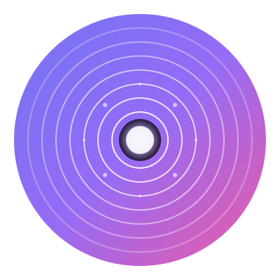

# TUNEL DEL TIEMPO

Tienda en línea especializada en figuras de acción, juguetes retro, consolas clásicas y coleccionables de los 80s, 90s y 2000s.



## Descripción

TUNEL DEL TIEMPO es una Progressive Web App (PWA) completa que permite a los usuarios explorar y comprar:

- **Figuras de Acción**: Marvel, DC, Dragon Ball Super, y más
- **Juguetes Retro**: Carritos de Batman, figuras clásicas
- **Consolas Retro**: Mini consolas originales de los 80s, 90s y 2000s
- **Discos de Música**: CDs y vinilos de los 80s, 90s y 2000s
- **Discos de Video**: DVDs y VHS de éxitos clásicos
- **Coleccionables**: Artículos únicos y exclusivos

## Características

- ✅ **PWA Completa**: Funciona offline, instalable, notificaciones push
- ✅ **Diseño Moderno**: Interfaz atractiva con tema oscuro/claro
- ✅ **Múltiples Categorías**: Organización por tipo de producto
- ✅ **Subida de Imágenes**: Sistema mejorado para agregar imágenes de productos
- ✅ **Carrito de Compras**: Gestión completa de pedidos
- ✅ **Panel de Administración**: Gestión de productos, categorías y pedidos
- ✅ **Notificaciones Push**: Sistema completo de notificaciones
- ✅ **Compatibilidad Multi-navegador**: Funciona en todos los navegadores modernos

## Tecnologías

- **Frontend**: Next.js, React, Redux Toolkit, TailwindCSS
- **Backend**: Next.js API Routes, MongoDB
- **PWA**: next-pwa, Service Workers
- **Notificaciones**: Web Push API
- **Autenticación**: NextAuth.js

## Instalación

```bash
# Instalar dependencias
npm install

# Configurar variables de entorno
cp .env.example .env
# Editar .env con tus credenciales de MongoDB y otras configuraciones

# Inicializar categorías (opcional)
node init-categories.js

# Ejecutar en desarrollo
npm run dev

# Construir para producción
npm run build
npm start
```

## Variables de Entorno

```env
MONGODB_URI=tu_uri_de_mongodb
NEXTAUTH_URL=http://localhost:3000
NEXTAUTH_SECRET=tu_secret_key
STRIPE_PUBLIC_KEY=tu_stripe_public_key
VAPID_PUBLIC_KEY=tu_vapid_public_key
VAPID_PRIVATE_KEY=tu_vapid_private_key
VAPID_EMAIL=tu_email
```

## Estructura del Proyecto

```
├── public/
│   ├── img/
│   │   ├── tunel-logo.svg          # Logo principal
│   │   └── favicons/               # Iconos PWA
│   └── sw-custom.js                # Service Worker personalizado
├── src/
│   ├── components/                 # Componentes React
│   ├── pages/                      # Páginas y API routes
│   ├── util/                       # Utilidades
│   └── styles/                     # Estilos globales
└── init-categories.js              # Script para inicializar categorías
```

## Categorías Disponibles

- Figuras Marvel
- Figuras DC
- Dragon Ball Super
- Carritos Batman
- Mini Consolas Retro
- Discos Música 80s/90s/2000s
- Discos Video 80s/90s/2000s
- Figuras de Acción
- Juguetes Retro
- Coleccionables
- Superhéroes
- Anime
- Videojuegos Retro
- Accesorios

## Características PWA

- ✅ Instalable en dispositivos móviles y desktop
- ✅ Funciona offline con cache inteligente
- ✅ Notificaciones push funcionales
- ✅ Compatible con todos los navegadores modernos
- ✅ Service Worker optimizado

## Desarrollo

```bash
# Modo desarrollo
npm run dev

# Construir
npm run build

# Iniciar producción
npm start
```

## Licencia

Este proyecto está bajo la Licencia MIT.

## Contacto

Para más información, contacta al equipo de desarrollo.

---

**TUNEL DEL TIEMPO** - Revive tus mejores recuerdos 🚀
